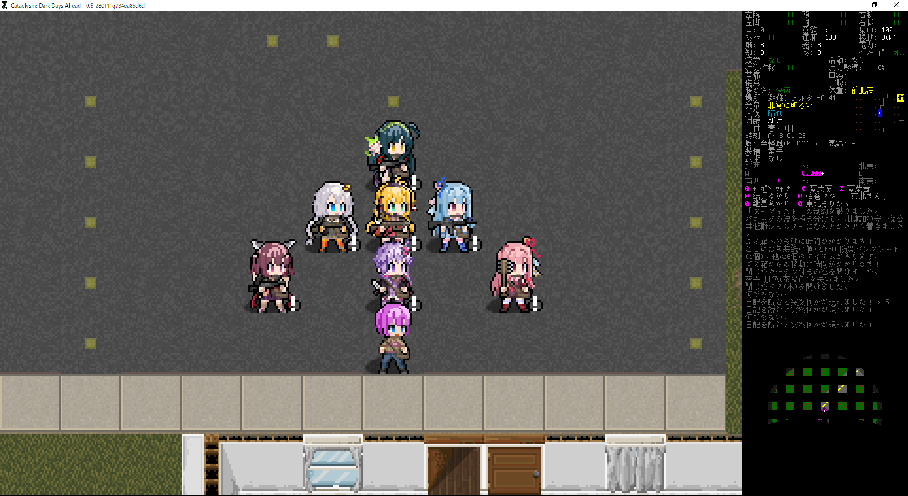

# Old JRPG-Like Character Tile for Cataclysm: DDA

プレイヤーやNPCのタイルを90年代JRPGキャラクター風に変更するMODです。 
MshockXottoplus, Chibi_UlticaなどのいわゆるMshockXotto系タイルに対応します。 

## 概要
頭の大きさがMshockXotto標準より大きくなり、3等身→2.5等身になります。 
身体部分の規格はMshockXotto標準と同じです。 
アイテムの手鏡を使用して目の形(たれ目・つり目・ジト目)などを変更できます。 
頭のサイズ変更に合わせて、バニラ製の頭装備用タイルを160種類置き換えます。

## 注意点
頭部分や肌の表示を変更する変異は既存タイルと互換性がありません。違和感がある場合は非表示にしてご利用ください。(バニラの頭装備は今後の更新で少しずつ対応予定) 
首より下の装備は既存タイルと互換がありますが、頭部分まではみ出すタイプの装備は表示がおかしくなる場合があります。 
以下は現時点で未対応・暫定対応です。
- 髭
- 男性の髪形(現状は女性用を流用)

## 対応(予定)MOD
以下MODと併用する場合は、このMODのロード順を一番最後にしてください。
- ボイスロイドMOD(原作: shaba様、メンテナ: YasuYasu様) 
月読アイ、結月ゆかり、弦巻マキ、紲星あかり、琴葉茜、琴葉葵、東北きりたん、東北ずん子、東北イタコ、京町セイカ、四国めたん、雨晴はう、春日部つむぎ、冥鳴ひまり、IA、ONEの通常表示に対応。
- おしゃれ服装委員会(作: YasuYasu様) 
まだ未対応。

## TODO
上ほど優先順位高
- 頭装備をChibi_Ulticaから移植(だいたい完了？)
- ボイスロイドMODのキャラクター対応
- おしゃれ服装委員会の頭装備対応
- 男性の髭対応
- 男性の髪形調整
- 上下セット装備をChibi_Ulticaから移植
- 肌が変化する変異をChibi_Ulticaから移植
- 移植したフルフェイスの頭装備が鬼ほどダサいのをなんとかする

## クレジット
- lispcoc(作者、メンテナ)
- shaba様、YasuYasu様(ボイスロイド系タイルの移植元)
- Chibi_Ulticaタイル製作者の皆様(バニラ製装備の移植元)

## ライセンス
- voiceroidフォルダ配下はボイスロイドMODに準拠します。
- migrationフォルダ配下はChibi_Ulticaタイルに準拠します。
- それ以外はCreative Commons Attribution-ShareAlike 3.0に準拠します。
